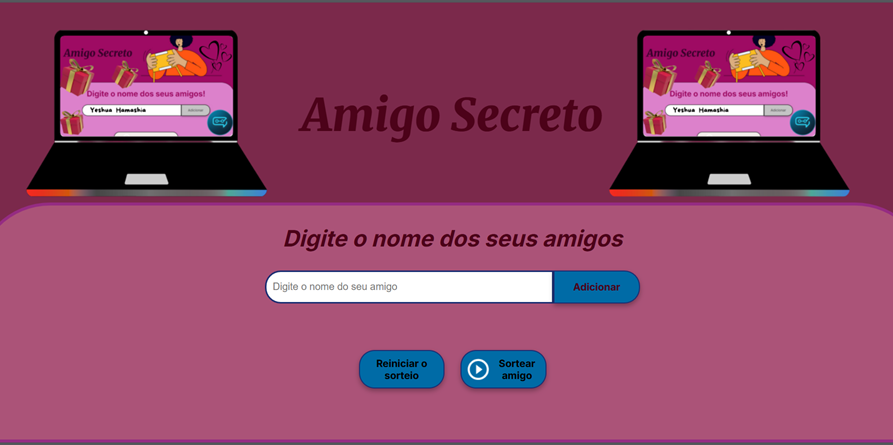

# Projeto/desafio: Amigo secreto!

Esse projeto foi desenvolvido como requisito obrigatório para conclusão dos módulos formação a partir do zero: iniciante em programação do curso Alura - Oracle Next Education.
O objetivo é criar uma aplicação web onde os usuários possam adicionar nomes à lista de "amigos" e, em seguida, realizar o sorteio de um amigo secreto.
## Tarefas específicas exigidas nesse projeto:👩🏻‍💻
- Capturar o valor do campo de entrada: Utilize document.getElementById ou document.querySelector para obter o texto inserido pelo usuário.

- Validar a entrada: Implemente uma validação para garantir que o campo não esteja vazio.

- Se estiver vazio, exiba um alerta com a mensagem de erro: "Por favor, insira um nome."

- Atualizar o array de amigos: Se o valor for válido, adicione-o ao array que armazena os nomes dos amigos usando o método .push().

- Limpar o campo de entrada: Após adicionar o nome, redefina o campo de texto para uma string vazia.
- Escreva uma função que selecione aleatoriamente um dos nomes armazenados no array amigos.

- Use Math.random() e Math.floor() para obter um índice aleatório.
- Mostrar o resultado: Atualizar o conteúdo do elemento de resultado usando document.getElementById() e innerHTML para exibir o amigo sorteado.

## Funcionalidades 📑
- Adicionar nomes: Os usuários escreverão o nome de um amigo em um campo de texto e o adicionarão a uma lista visível ao clicar em adicionar.
- Validar a entrada: Se o campo de texto estiver vazio e o usuário clicar em adicionar,o programa mostrará um alerta solicitando digitar o nome de um amigo.
- Impedir a duplicidade de nomes: Se o usuário digitar o nome de um amigo duas vezes, o programa exibirá um alerta avisando que este nome já se encontra na lista de sorteio.
- Número mínimo de participantes: A realização do sorteio exige a participação de pelo menos três pessoas, caso contrário um alerta ira destacar a importância de digitar mais nomes.
- Visualização dos nomes: Os nomes digitados no campo de texto e adicionados serão descritos logo abaixo em uma lista.
- Sorteio aleatório: Ao clicar em sortear amigo, um nome da lista será selecionado aleatóriamente e exibido na tela.
- Reiniciar o sorteio: Ao selecionar essa opção todos os campos serão limpos possibilitando um novo sorteio.
## Tecnologias usadas:🗃️
 Responsável pela estrutura da página e conteúdo.

  Responsável pelo layout da página. 

  Responsável pela interação do usuário com a interface.

## 🔗 Link do projeto/desafio amigo secreto!
[link](https://github.com/Aninha-create/challenge-amigo-secreto-oficial/tree/main/challenge-amigo-secreto-oficial)

## Como usar a aplicação:🎥

## Melhorias futura:🤖
- Tornar a aplicação responsiva a todo tamanho de tela.
- Funções para:
1- Não sortear a si mesmo. 
2- Excluir o resultado anterior antes de selecionar o próximo amigo a ser sorteado, para manter o sigilo.
3-Exibir na tela: término do sorteio porque todos os nomes já foram sorteados.
## Contato:
 
[Linkedin](https://www.linkedin.com/in/ana-rachel-rodrigues-da-costa-analista-de-dados/)    

## Desenvolvedora: 
Ana Costa

